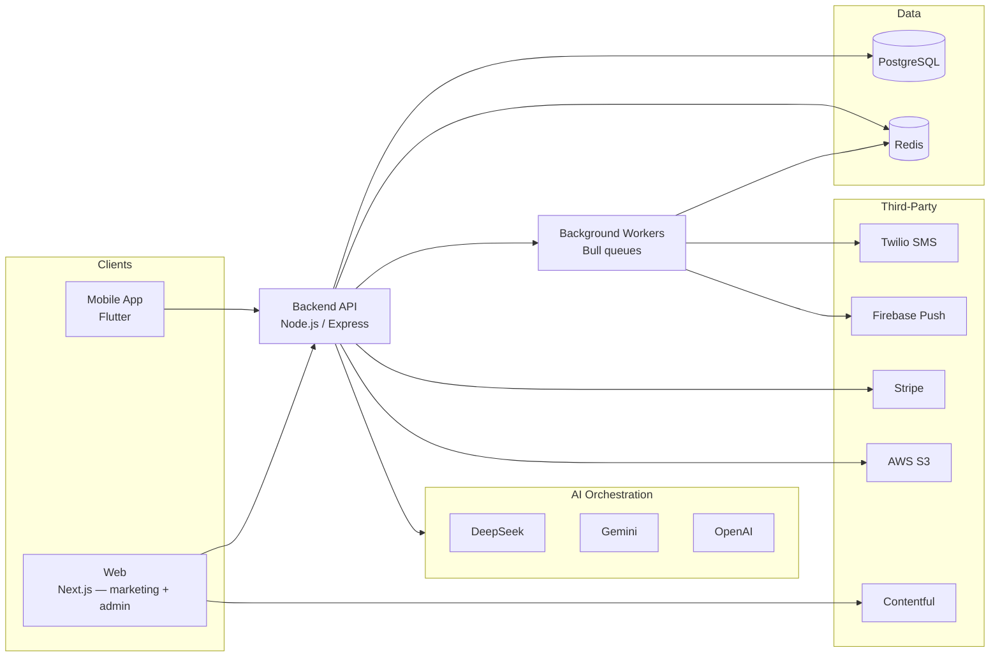

<picture>
  <source media="(prefers-color-scheme: dark)" srcset="profile/assets/logo-light.png">
  <source media="(prefers-color-scheme: light)" srcset="profile/assets/logo-dark.png">
  
</picture>

<h3>Wellbeing Beyond Borders</h3>

AI-powered wellness intelligence for families separated by distance, not love. 
We help the diaspora look after aging parents back home — before a small problem becomes a crisis.

  
  
  
  

---

## About Famva

Famva is a remote elderly-care platform built for the diaspora, starting with UK-based families who have parents in Nigeria. A **Sponsor** (the adult child abroad) links to their parent's profile and gets AI-generated care plans, meal plans, and exercise routines tailored to the elderly person's health conditions, mobility, and local context, plus early-warning alerts when day-to-day patterns start to slip.

The goal isn't to replace visits home. It's to close the gap in between — so a decline in health or mood gets noticed in days, not months.

**What the platform does:**

- **AI care plans** — daily task lists (medication, hydration, exercise, wellness) generated from the elderly person's profile, conditions, and routine.
- **AI meal plans** — 7-day Nigerian-cuisine meal plans that respect medical conditions, food preferences, and intolerances, with automatic nutritional flagging (e.g. low-sodium guidance for hypertension).
- **AI exercise routines** — daily, mobility-appropriate exercise sets, from standing routines to fully seated ones.
- **Silent Decline Alerts** — a statistical monitoring engine that watches task completion, mood, step count, and sleep against a rolling baseline and proactively alerts the sponsor when something looks off.
- **Sponsor + admin tooling** — subscription billing, notifications, and an internal dashboard for operating the platform.

## Our Repositories

| Repository | Description | Primary Stack |
|---|---|---|
| [`backend`](https://github.com/famva-ai/backend) | Core REST API — auth, profiles, AI orchestration, health metrics, alerts, billing, notifications | Node.js · TypeScript · Express · PostgreSQL · Redis |
| [`web`](https://github.com/famva-ai/web) | Marketing site and admin dashboard | Next.js · React · TypeScript · Tailwind CSS |
| [`mobile-app`](https://github.com/famva-ai/mobile-app) | Cross-platform app for sponsors and elderly users | Flutter · Dart |
| [`.github`](https://github.com/famva-ai/.github) | Organisation-wide health files and this profile | — |

> These repositories are private. If you need access — investors, partners, contractors — reach out at [hello@famva.com](mailto:hello@famva.com).

## How It Fits Together

The backend runs a **multi-provider AI fallback chain** (DeepSeek → Gemini → OpenAI) so care plan, meal plan, and exercise generation keeps working even if a provider is degraded — with hardcoded safe defaults as a last resort. Health alerting itself is a deterministic, rule-based engine rather than an LLM, so it stays predictable and explainable.

## Tech Stack

| Layer | Highlights |
|---|---|
| **Backend** | Node.js, TypeScript, Express, Sequelize/PostgreSQL, Redis + Bull job queues, JWT auth, Swagger/OpenAPI docs |
| **Web** | Next.js, React, Tailwind CSS, shadcn/ui, Contentful (blog/CMS), Vercel Analytics |
| **Mobile** | Flutter, MVVM architecture (Provider + get_it + auto_route) |
| **AI** | DeepSeek, Google Gemini, OpenAI — orchestrated with provider fallback and schema-enforced structured output |
| **Infrastructure** | Docker Compose, Nginx + Let's Encrypt, GitHub Actions |
| **Integrations** | Stripe (billing), Twilio (SMS/OTP), Firebase (push), AWS S3 (file storage) |

## Security & Privacy

Elderly users' health data is sensitive by nature, so it's treated that way throughout the stack:

- Health-sensitive fields (diagnoses, medications, sleep patterns, etc.) are **encrypted at rest** and never stored in plaintext.
- All traffic is served over **HTTPS/TLS**.
- Access is **role-based** (sponsor / elderly / admin), with JWT-based auth and full **audit logging** on admin actions.
- Every AI-generated recommendation has a **deterministic fallback**, so the product degrades gracefully rather than failing silently.

Found a security concern? Please report it privately to [hello@famva.com](mailto:hello@famva.com) rather than opening a public issue.

## Get in Touch

- **Website:** [famva.co.uk](https://famva.co.uk)
- **Email:** [hello@famva.com](mailto:hello@famva.com)
- **Company:** CareBridgeAI LTD

Built with care for families everywhere.

